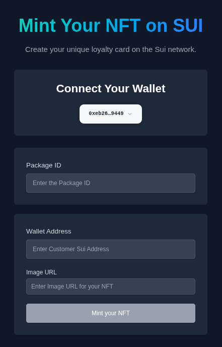

# 🧾 Sui NFT Minting dApp – Loyalty Card



A decentralized application (dApp) built with Next.js and @mysten/dapp-kit that enables minting "Loyalty Card" NFTs on the Sui blockchain.

## 🚀 Features

- **Wallet Integration**: Seamless connection with Sui-compatible wallets
- **NFT Minting**: Create Loyalty Card NFTs with custom images
- **Real-time Feedback**: Dynamic UI updates for transaction status
- **Dark Mode**: Full support for system color preferences
- **Modern Stack**: Built with Next.js 15, React 19, and TypeScript

## 🧱 Tech Stack

| Category   | Technologies |
|------------|-------------|
| Frontend   | Next.js, React, Tailwind CSS |
| Blockchain | @mysten/dapp-kit, @mysten/sui |
| Language   | TypeScript |
## ⚙️ Getting Started

This guide walks you through deploying your smart contract and running the frontend locally.

### Prerequisites

- Node.js (v20+ recommended)
- Package manager: npm, yarn, pnpm, or bun
- Sui CLI installed and configured
- Sui-compatible wallet (e.g., Sui Wallet, WELLDONE Wallet)


### 🌐 Step 2: Frontend Setup

#### 1. Clone the Repository

```bash
git clone <your-repo-url>
cd sui_workshop
```

#### 2. Install Dependencies

```bash
npm install
# or
yarn install
```

#### 3. Start Development Server

```bash
npm run dev
# or
yarn dev
```
Your app will be available at [http://localhost:3000](http://localhost:3000)

## 🧑‍💻 Usage Guide

1. **Connect Your Wallet**
   - Click the "Connect Wallet" button
   - Authorize your Sui-compatible wallet when prompted

2. **Configure Package ID**
   - Paste the Package ID from your deployed contract
   - This links the frontend to your smart contract

3. **Mint Your NFT**
   - Enter the recipient's Sui wallet address
   - Provide a public image URL for the NFT
   - Click "Mint your NFT"
   - Confirm the transaction in your wallet

4. **Monitor Status**
   - Watch for real-time feedback on transaction status
   - Success/error messages will appear automatically

## 📝 License

This project is MIT licensed.

